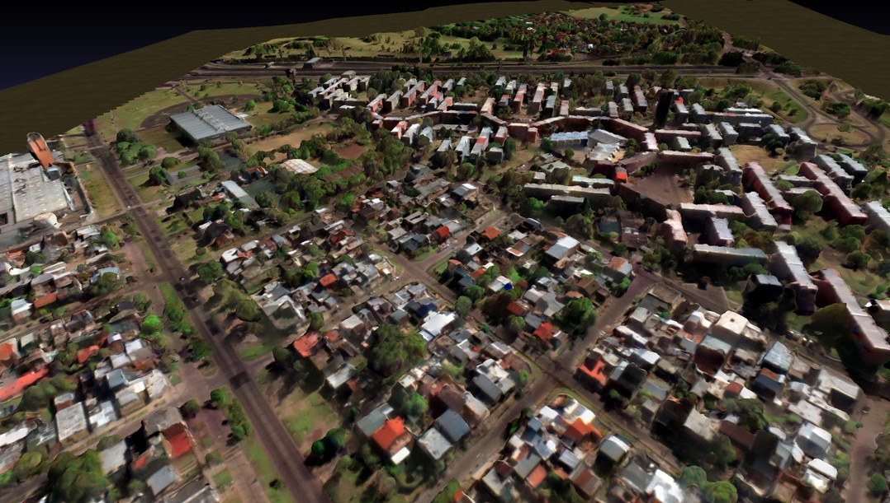
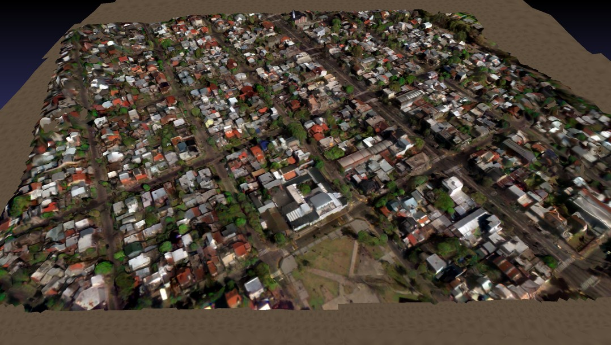
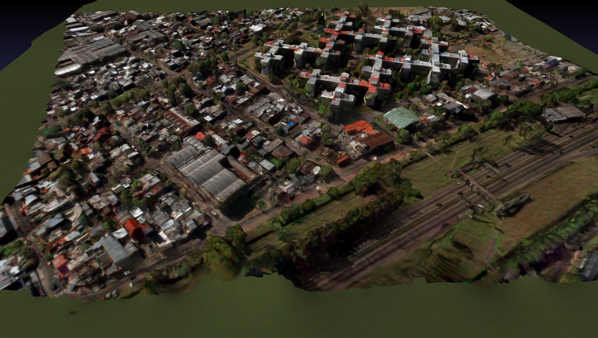

# SatelliteSurfaceReconstruction
3D Surface Reconstruction From Multi-Date Satellite Images

  
  
   

## Getting Started
- [Installation Instructions](Getting_Started.md#installation-instructions-for-ubuntu-1804) 
- [Download the IARPA MVS3DM Dataset](Getting_Started.md#download-satellite-images) 
- [Run the Pipeline](Getting_Started.md#run-the-ssr-pipeline)
- [Evaluate the Reconstruction Results](https://github.com/SBCV/SatelliteSurfaceReconstructionEvaluation)
- [Trouble Shooting](Getting_Started.md#trouble-shooting--debugging)

## Citation
If you use this project for your research, please cite the following paper:

<a href="https://www.int-arch-photogramm-remote-sens-spatial-inf-sci.net/XLIII-B2-2021/313/2021/">[paper]</a>&nbsp;<a href="https://arxiv.org/abs/2102.02502">[arxiv]</a> 
@article{isprs-archives-XLIII-B2-2021-313-2021, 
&nbsp;author={Bullinger, S. and Bodensteiner, C. and Arens, M.}, 
&nbsp;title={3D SURFACE RECONSTRUCTION FROM MULTI-DATE SATELLITE IMAGES}, 
&nbsp;journal={The International Archives of the Photogrammetry, Remote Sensing and Spatial Information Sciences}, 
&nbsp;volume = {XLIII-B2-2021}, 
&nbsp;year={2021} 
&nbsp;pages = {313--320}, 
&nbsp;URL = {<a href="https://www.int-arch-photogramm-remote-sens-spatial-inf-sci.net/XLIII-B2-2021/313/2021/">https://www.int-arch-photogramm-remote-sens-spatial-inf-sci.net/XLIII-B2-2021/313/2021/</a>}, 
&nbsp;doi = {10.5194/isprs-archives-XLIII-B2-2021-313-2021} 
} 
